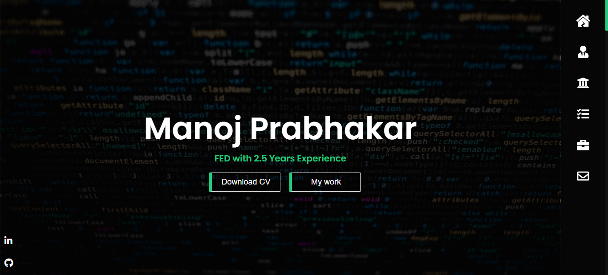
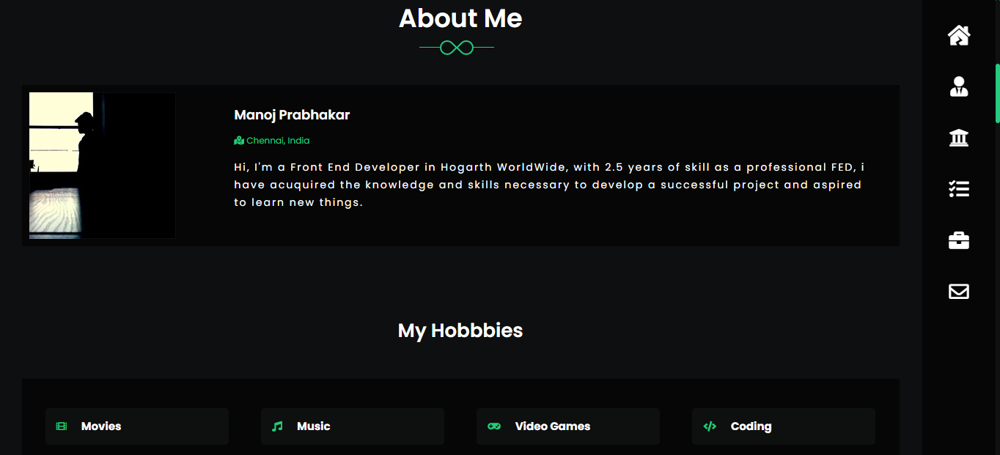

## Screenshots

## Deployment

It has been debloyed in netlify

open [https://manojprabhakar-portfolio.netlify.app/](https://manojprabhakar-portfolio.netlify.app/)

### `npm start`

Runs the app in the development mode.\
Open [http://localhost:3000](http://localhost:3000) to view it in the browser.
